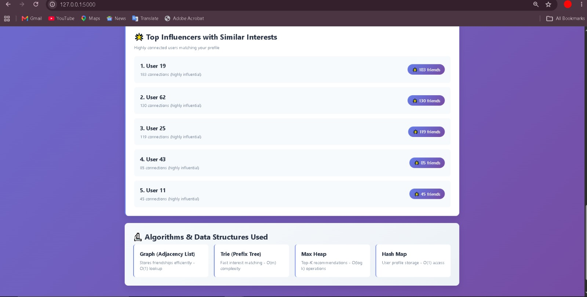

# Social Network Analysis & Friend Recommendation System

A scalable social network analysis and friend recommendation system developed as an M.Tech CSE project.

The system analyzes social-network relationships and generates friend recommendations using graph-based relationships and common user interests.

## 🚀 Features

- Social network graph construction
- Friend-of-friend recommendations
- Interest-based friend recommendations
- Trie-based interest matching
- Max Heap-based recommendation ranking
- Top influencer identification
- CLI interface
- Flask-based web interface
- Efficient user and relationship lookup

## 🧠 Data Structures Used

### 1. Hash Map

Used for efficient user-profile and adjacency-list lookup.

### 2. Graph — Adjacency List

Represents friendships between users efficiently for a sparse social network.

### 3. Trie

Used for interest-based matching and prefix searching.

### 4. Max Heap

Used to efficiently rank and retrieve the highest-scoring recommendations.

## ⚙️ Recommendation Approach

The system generates recommendations using two major signals:

1. Mutual/friend-of-friend relationships
2. Common user interests

Candidates are scored and ranked to produce relevant recommendations.

## 🏗️ Project Architecture

```text
User
 │
 ▼
Flask Web Interface / CLI
 │
 ▼
Data Loader
 │
 ├── User Profiles
 └── Friendship Data
 │
 ▼
Graph Builder
 │
 ▼
Adjacency List
 │
 ├── Friend-of-Friend Recommendation
 │
 └── Interest Matching
       │
       ▼
      Trie
       │
       ▼
Recommendation Ranking
       │
       ▼
    Max Heap
       │
       ▼
Recommended Friends

### 📸 Screenshots

### Web Application


### Friend Recommendations


### Top Influencers

